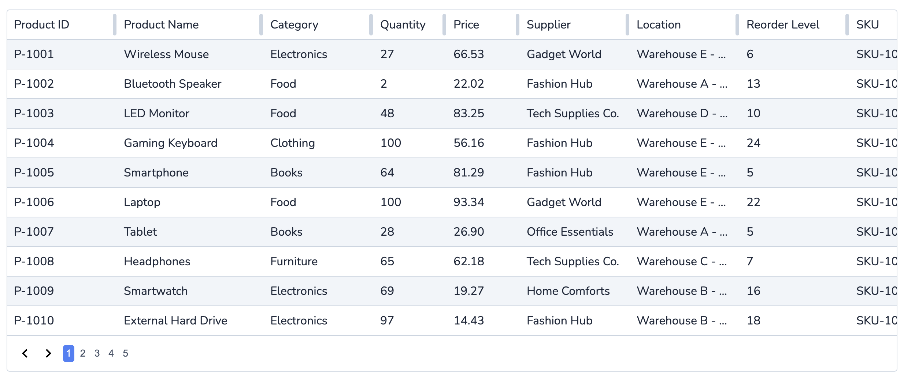

# Simple Table

If you have any questions or need support, feel free to join our Discord group at [https://discord.gg/RvKHCfg3PC](https://discord.gg/RvKHCfg3PC).

Simple Table is a React grid package designed to provide a flexible and easy-to-use table component for your React applications. Visit our website at [www.simple-table.com](http://www.simple-table.com) for more information and documentation.



## Example Usage

```tsx
import { SimpleTable } from "simple-table-core";
import "simple-table-core/dist/style.css";

export const SAMPLE_HEADERS: any[] = [
  { label: "Product ID", accessor: "id", width: 150 },
  { label: "Product Name", accessor: "productName", width: 200 },
  { label: "Category", accessor: "category", width: 150 },
  { label: "Quantity", accessor: "quantity", width: 100 },
];

function App() {
  return (
    <SimpleTable
      defaultHeaders={SAMPLE_HEADERS}
      height="auto"
      rows={[
        {
          id: 1,
          productName: "Product 1",
          category: "Category 1",
          quantity: 10,
        },
      ]}
    />
  );
}
```

Import the CSS file to apply the styles to your table.

## Props

The Simple Table component accepts the following props:

- **defaultHeaders**: An array of `HeaderObject` defining the table headers. Each `HeaderObject` includes:

  - **label**: A string representing the display name of the column header.
  - **accessor**: A string used to access the corresponding data in each row.
  - **width**: A number specifying the width of the column.
  - **cellRenderer**: An optional function that takes a row object and returns a `ReactNode` for custom cell rendering.

- **enableColumnResizing**: A boolean to enable or disable column resizing. Default is `true`.
- **height**: The height of the table.
- **hideFooter**: A boolean to hide or show the footer. Default is `false`.
- **nextIcon**: A React element to display as the next page icon. Default is `<AngleRightIcon />`.
- **prevIcon**: A React element to display as the previous page icon. Default is `<AngleLeftIcon />`.
- **rows**: An array of data rows to be displayed in the table.
- **rowsPerPage**: The number of rows to display per page. Default is `10`.
- **shouldPaginate**: A boolean to enable or disable pagination. Default is `true`.

## Customizable Styles

All styles for the Simple Table are customizable and can be found in the `table.css` file. You can modify these styles to fit the design needs of your application.

### CSS Variables

You can override the following CSS variables to customize the appearance of the table:

- `--st-border-radius`
- `--st-table-border-color`
- `--st-border-width`
- `--st-resize-handle-color`
- `--st-separator-border-color`
- `--st-odd-row-background-color`
- `--st-dragging-background-color`
- `--st-selected-cell-background-color`
- `--st-selected-first-cell-background-color`
- `--st-border-top-color`
- `--st-border-bottom-color`
- `--st-border-left-color`
- `--st-border-right-color`
- `--st-border-top-white-color`
- `--st-footer-background-color`

### CSS Class Names

The following CSS class names are used in the table and can be customized:

- `.st-table-wrapper`
- `.st-table`
- `.st-table-header-cell`
- `.st-table-cell`
- `.st-table-header-label`
- `.st-table-header-resize-handle`
- `.st-table-row-separator`
- `.st-table-cell-odd-row`
- `.st-dragging`
- `.st-table-cell-selected`
- `.st-table-cell-selected-first`
- `.border-top-blue`
- `.border-bottom-blue`
- `.border-left-blue`
- `.border-right-blue`
- `.border-top-white`
- `.st-footer`
- `.st-next-prev-btn`
- `.st-page-btn`
- `.st-page-btn.active`

For more detailed usage and examples, please refer to our [documentation](http://www.simple-table.com/docs).

## License

This project is licensed under the MIT License - see the [LICENSE](LICENSE) file for details.
